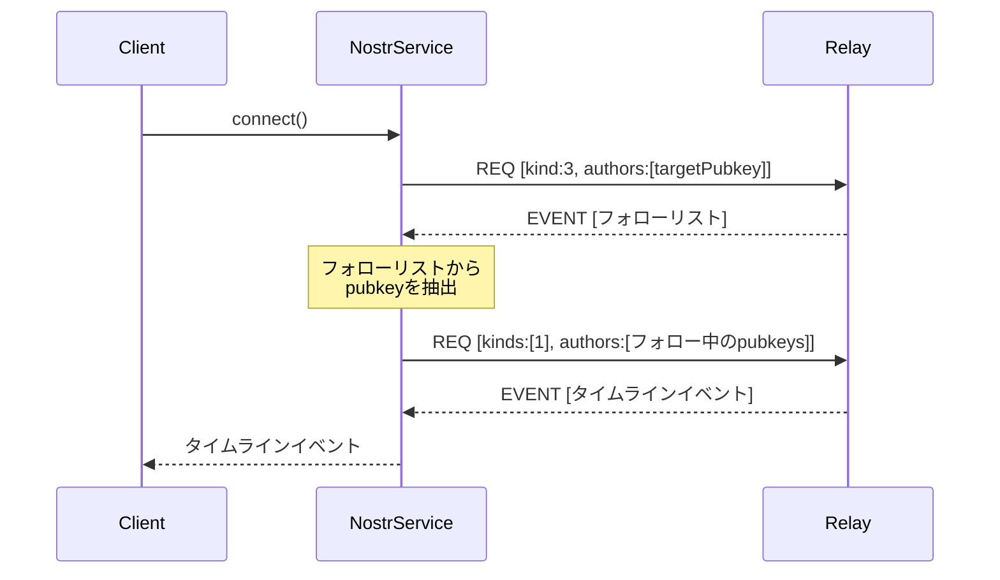

## 概要

- TwitterライクなSNSのクライアント
- バックエンドはNostrを使用する. 詳細は[NIP01](./nip-01.md)を参照。
- POCとして簡易的な実装を行う

## POCの要件


### 機能要件

- WebSocketで以下のリレーサーバに接続する実装
  - `wss://nos.lol/`
- 以下のpublickeyの投稿を取得する
  - `26bb2ebed6c552d670c804b0d655267b3c662b21e026d6e48ac93a6070530958`
- 投稿内容を取得して画面に追加して表示する


### 画面要件

- タイムラインを表示する1画面のみとする
- Twitterライクな上から下に投稿が並んだ画面とする
- 新規投稿があったら画面の下部に追加する

## POC設計

### アーキテクチャ設計

POCとして最小限の構成で実装します。以下のコンポーネント構成を提案します：

```
App Component
├── Timeline Component
│   └── Post Component
└── Nostr Service
    └── WebSocket Connection
```

### コンポーネント構成

1. **App Component**: アプリケーションのルートコンポーネント
2. **Timeline Component**: 投稿一覧を表示するコンポーネント
3. **Post Component**: 個々の投稿を表示するコンポーネント
4. **Nostr Service**: Nostrリレーとの通信を担当するサービス

### データフロー

1. アプリケーション起動時にNostrServiceがWebSocketでリレーに接続
2. 特定ユーザーの投稿を購読するREQメッセージを送信
3. リレーからEVENTメッセージで投稿データを受信
4. 受信したデータをTimelineComponentに通知
5. 新規投稿があれば自動的にTimelineComponentに追加

### 実装詳細

#### 1. Nostr Service

```typescript
@Injectable({
  providedIn: 'root'
})
export class NostrService {
  private ws: WebSocket | null = null;
  private subscriptionId = 'timeline-sub';
  private events$ = new Subject<NostrEvent>();
  
  constructor() {}
  
  // リレーに接続
  connect(): Observable<NostrEvent> {
    this.ws = new WebSocket('wss://nos.lol/');
    
    this.ws.onopen = () => {
      console.log('Connected to relay');
      this.subscribe();
    };
    
    this.ws.onmessage = (event) => {
      const data = JSON.parse(event.data);
      if (data[0] === 'EVENT' && data[1] === this.subscriptionId) {
        this.events$.next(data[2]);
      }
    };
    
    this.ws.onerror = (error) => {
      console.error('WebSocket error:', error);
    };
    
    this.ws.onclose = () => {
      console.log('Disconnected from relay');
    };
    
    return this.events$.asObservable();
  }
  
  // 特定ユーザーの投稿を購読
  private subscribe() {
    if (!this.ws) return;
    
    const req = [
      'REQ',
      this.subscriptionId,
      {
        authors: ['26bb2ebed6c552d670c804b0d655267b3c662b21e026d6e48ac93a6070530958'],
        kinds: [1], // テキスト投稿
        limit: 20
      }
    ];
    
    this.ws.send(JSON.stringify(req));
  }
  
  // 接続を閉じる
  disconnect() {
    if (this.ws) {
      this.ws.close();
      this.ws = null;
    }
  }
}
```

#### 2. Timeline Component

```typescript
@Component({
  selector: 'app-timeline',
  imports: [CommonModule, PostComponent],
  template: `
    <div class="timeline">
      <app-post *ngFor="let post of posts" [post]="post"></app-post>
    </div>
  `,
  styles: [`
    .timeline {
      display: flex;
      flex-direction: column;
      gap: 16px;
      padding: 16px;
    }
  `]
})
export class TimelineComponent implements OnInit, OnDestroy {
  posts: NostrEvent[] = [];
  private subscription: Subscription | null = null;
  
  constructor(private nostrService: NostrService) {}
  
  ngOnInit() {
    this.subscription = this.nostrService.connect().subscribe(event => {
      // 新しい投稿を配列の先頭に追加
      this.posts = [event, ...this.posts];
    });
  }
  
  ngOnDestroy() {
    if (this.subscription) {
      this.subscription.unsubscribe();
    }
    this.nostrService.disconnect();
  }
}
```

#### 3. Post Component

```typescript
@Component({
  selector: 'app-post',
  imports: [CommonModule],
  template: `
    <div class="post">
      <div class="post-header">
        <div class="post-author">{{ getShortPubkey(post.pubkey) }}</div>
        <div class="post-time">{{ getFormattedTime(post.created_at) }}</div>
      </div>
      <div class="post-content">{{ post.content }}</div>
    </div>
  `,
  styles: [`
    .post {
      border: 1px solid #e1e8ed;
      border-radius: 8px;
      padding: 16px;
      background-color: white;
    }
    .post-header {
      display: flex;
      justify-content: space-between;
      margin-bottom: 8px;
    }
    .post-author {
      font-weight: bold;
    }
    .post-time {
      color: #657786;
      font-size: 0.9em;
    }
    .post-content {
      white-space: pre-wrap;
      word-break: break-word;
    }
  `]
})
export class PostComponent {
  @Input() post!: NostrEvent;
  
  getShortPubkey(pubkey: string): string {
    return pubkey.substring(0, 8) + '...' + pubkey.substring(pubkey.length - 8);
  }
  
  getFormattedTime(timestamp: number): string {
    return new Date(timestamp * 1000).toLocaleString();
  }
}
```

#### 4. App Component

```typescript
@Component({
  selector: 'app-root',
  imports: [TimelineComponent],
  template: `
    <div class="app-container">
      <header class="app-header">
        <h1>Nostr Timeline</h1>
      </header>
      <main>
        <app-timeline></app-timeline>
      </main>
    </div>
  `,
  styles: [`
    .app-container {
      max-width: 600px;
      margin: 0 auto;
      font-family: -apple-system, BlinkMacSystemFont, "Segoe UI", Roboto, Helvetica, Arial, sans-serif;
    }
    .app-header {
      padding: 16px;
      border-bottom: 1px solid #e1e8ed;
      position: sticky;
      top: 0;
      background-color: white;
      z-index: 100;
    }
    h1 {
      margin: 0;
      font-size: 1.5rem;
    }
  `]
})
export class AppComponent {}
```

### 実装ステップ

1. **準備**: 既存のAngularプロジェクト構造を確認
   - プロジェクト構造の確認
   - 必要なファイルの特定
   - **commit**: "Initial project structure analysis"

2. **NostrService実装**: WebSocket接続とイベント処理の実装
   - NostrServiceクラスの作成
   - WebSocket接続の実装
   - イベント処理の実装
   - **テスト**: WebSocket接続テストの作成と実行
   - **commit**: "Implement NostrService with WebSocket connection"

3. **コンポーネント実装**: Timeline、Postコンポーネントの実装
   - PostComponentの作成（Standalone）
   - TimelineComponentの作成（Standalone）
   - AppComponentの更新
   - **テスト**: コンポーネントの単体テスト作成と実行
   - **commit**: "Implement Timeline and Post components"

4. **統合**: コンポーネントとサービスの統合
   - AppModuleの設定
   - 依存関係の注入設定
   - **テスト**: 統合テストの作成と実行
   - **commit**: "Integrate components and services"

5. **スタイリング**: TwitterライクなUIの実装
   - CSSスタイルの適用
   - レスポンシブデザインの調整
   - **テスト**: 異なる画面サイズでの表示確認
   - **commit**: "Add styling for Twitter-like UI"

6. **最終テスト**: 全体の動作確認
   - エンドツーエンドテストの実行
   - エラー処理の確認
   - パフォーマンスの確認
   - **commit**: "Final testing and adjustments"

### 技術的考慮事項

1. **WebSocket接続管理**: 接続の安定性確保と再接続ロジック
2. **パフォーマンス**: 大量のイベント処理時のパフォーマンス最適化
3. **エラーハンドリング**: 接続エラーや不正なデータの処理

## フォロワーのタイムライン表示機能の拡張

### 機能概要

特定のユーザーがフォローしている他のユーザーの投稿（タイムライン）を表示する機能を追加します。
この機能はNIP-02（Follow List）の仕様に基づいて実装します。

### 設計変更点

#### アーキテクチャ変更

現在の設計を拡張し、フォローリスト取得とフォロワータイムライン表示の機能を追加します：

```
App Component
├── Timeline Component
│   └── Post Component
└── Nostr Service
    ├── WebSocket Connection
    ├── Follow List Fetcher
    └── Timeline Subscriber
```

#### データフロー（拡張版）

1. アプリケーション起動時にNostrServiceがWebSocketでリレーに接続
2. 特定ユーザーのフォローリスト（kind 3）を取得するREQメッセージを送信
3. リレーからフォローリストを受信し、フォロー中のユーザーのpubkeyを抽出
4. 抽出したpubkeyリストを使用して、フォロー中のユーザーの投稿（kind 1）を購読
5. リレーからEVENTメッセージで投稿データを受信
6. 受信したデータをTimelineComponentに通知
7. 新規投稿があれば自動的にTimelineComponentに追加



### 実装詳細

#### 1. NostrService の拡張

```typescript
@Injectable({
  providedIn: 'root'
})
export class NostrService {
  private ws: WebSocket | null = null;
  private timelineSubscriptionId = 'timeline-sub';
  private followListSubscriptionId = 'follow-list-sub';
  private events$ = new Subject<NostrEvent>();
  private followedPubkeys: string[] = [];
  private targetPubkey = '26bb2ebed6c552d670c804b0d655267b3c662b21e026d6e48ac93a6070530958';
  
  constructor() {}
  
  // リレーに接続してフォローリストを取得し、その後タイムラインを購読
  connect(): Observable<NostrEvent> {
    this.ws = new WebSocket('wss://nos.lol/');
    
    this.ws.onopen = () => {
      console.log('Connected to relay');
      this.fetchFollowList();
    };
    
    this.ws.onmessage = (event) => {
      const data = JSON.parse(event.data);
      
      if (data[0] === 'EVENT') {
        if (data[1] === this.followListSubscriptionId) {
          // フォローリストイベントの処理
          if (data[2].kind === 3) {
            this.processFollowList(data[2]);
          }
        } else if (data[1] === this.timelineSubscriptionId) {
          // タイムラインイベントの処理
          this.events$.next(data[2]);
        }
      } else if (data[0] === 'EOSE') {
        if (data[1] === this.followListSubscriptionId) {
          console.log('End of stored follow list events');
          // フォローリストの取得が完了したら、タイムラインを購読
          this.subscribeToTimeline();
        } else if (data[1] === this.timelineSubscriptionId) {
          console.log('End of stored timeline events');
        }
      }
    };
    
    this.ws.onerror = (error) => {
      console.error('WebSocket error:', error);
    };
    
    this.ws.onclose = () => {
      console.log('Disconnected from relay');
    };
    
    return this.events$.asObservable();
  }
  
  // 特定ユーザーのフォローリストを取得
  private fetchFollowList() {
    if (!this.ws) return;
    
    const req = [
      'REQ',
      this.followListSubscriptionId,
      {
        authors: [this.targetPubkey],
        kinds: [3], // フォローリスト
        limit: 1    // 最新のフォローリストのみ
      }
    ];
    
    this.ws.send(JSON.stringify(req));
  }
  
  // フォローリストからpubkeyを抽出
  private processFollowList(event: NostrEvent) {
    // フォローリストからpタグを抽出
    this.followedPubkeys = event.tags
      .filter(tag => tag[0] === 'p')
      .map(tag => tag[1]);
    
    console.log(`Extracted ${this.followedPubkeys.length} followed pubkeys`);
    
    // フォローしているユーザーがいない場合は、ターゲットユーザー自身を追加
    if (this.followedPubkeys.length === 0) {
      this.followedPubkeys.push(this.targetPubkey);
    }
  }
  
  // フォロー中のユーザーのタイムラインを購読
  private subscribeToTimeline() {
    if (!this.ws || this.followedPubkeys.length === 0) return;
    
    // フォローリストの購読を閉じる
    const closeMsg = ['CLOSE', this.followListSubscriptionId];
    this.ws.send(JSON.stringify(closeMsg));
    
    // タイムラインの購読を開始
    const req = [
      'REQ',
      this.timelineSubscriptionId,
      {
        authors: this.followedPubkeys,
        kinds: [1], // テキスト投稿
        limit: 50
      }
    ];
    
    this.ws.send(JSON.stringify(req));
  }
  
  // 接続を閉じる
  disconnect() {
    if (this.ws) {
      // サブスクリプションを閉じる
      if (this.followListSubscriptionId) {
        const closeFollowListMsg = ['CLOSE', this.followListSubscriptionId];
        this.ws.send(JSON.stringify(closeFollowListMsg));
      }
      
      if (this.timelineSubscriptionId) {
        const closeTimelineMsg = ['CLOSE', this.timelineSubscriptionId];
        this.ws.send(JSON.stringify(closeTimelineMsg));
      }
      
      // WebSocket接続を閉じる
      this.ws.close();
      this.ws = null;
    }
  }
}
```

### 実装ステップ

1. **NostrServiceの拡張**:
   - フォローリスト取得機能の追加
   - フォロー中のユーザーのpubkey抽出機能の追加
   - タイムライン購読機能の修正
   - **commit**: "Add follow list fetching and follower timeline subscription"

2. **テスト**:
   - フォローリスト取得のテスト
   - フォロワータイムライン表示のテスト
   - エラー処理のテスト
   - **commit**: "Add tests for follower timeline functionality"

3. **UI調整**:
   - タイムラインコンポーネントの表示調整
   - ローディング状態の改善
   - **commit**: "Adjust UI for follower timeline display"

### 技術的考慮事項

1. **フォローリストの更新**: 定期的にフォローリストを更新するか検討
2. **エラーハンドリング**: フォローリストが取得できない場合のフォールバック処理
3. **パフォーマンス**: 多数のフォロー中ユーザーがいる場合の処理最適化
4. **ユーザーエクスペリエンス**: フォローリスト取得中のローディング表示
